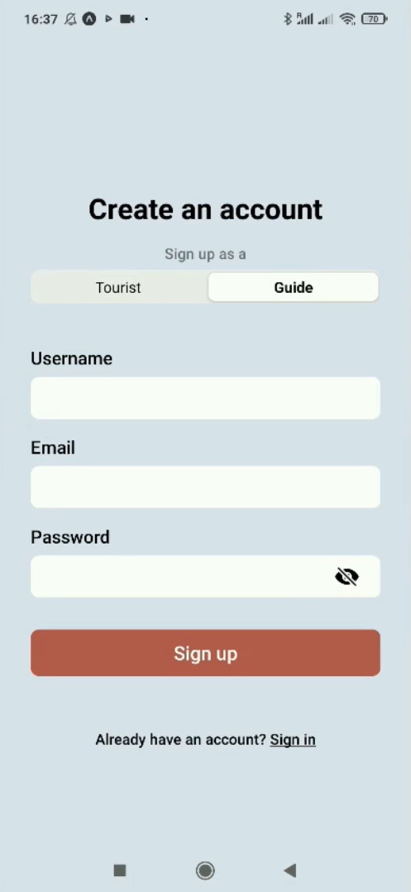
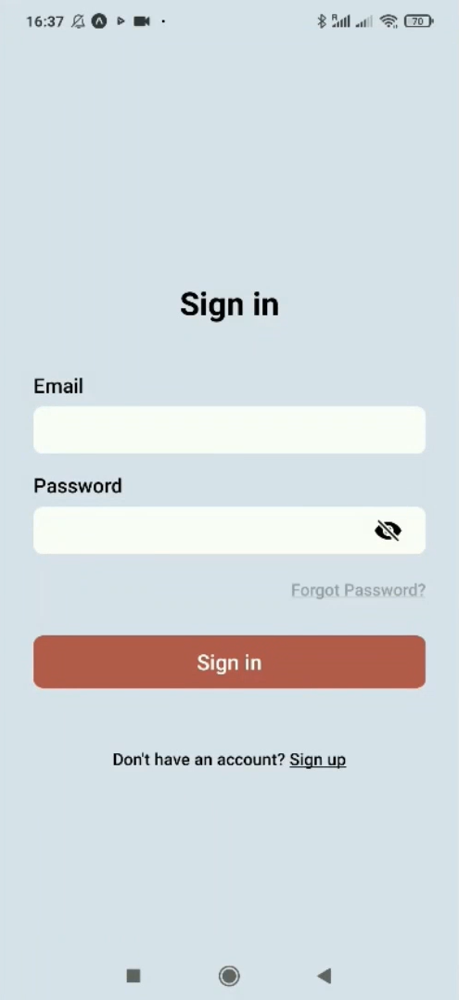
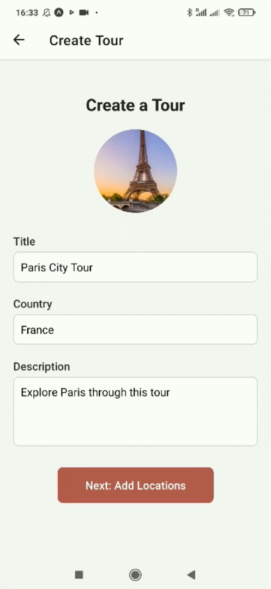
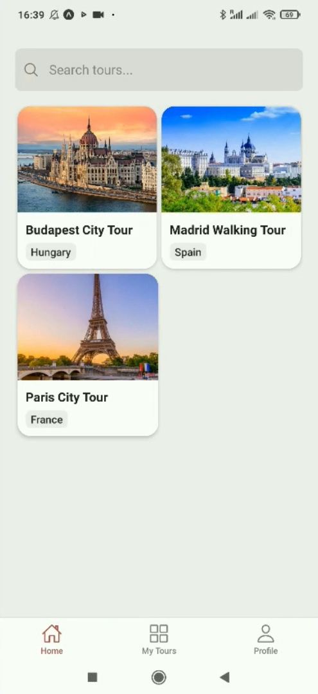
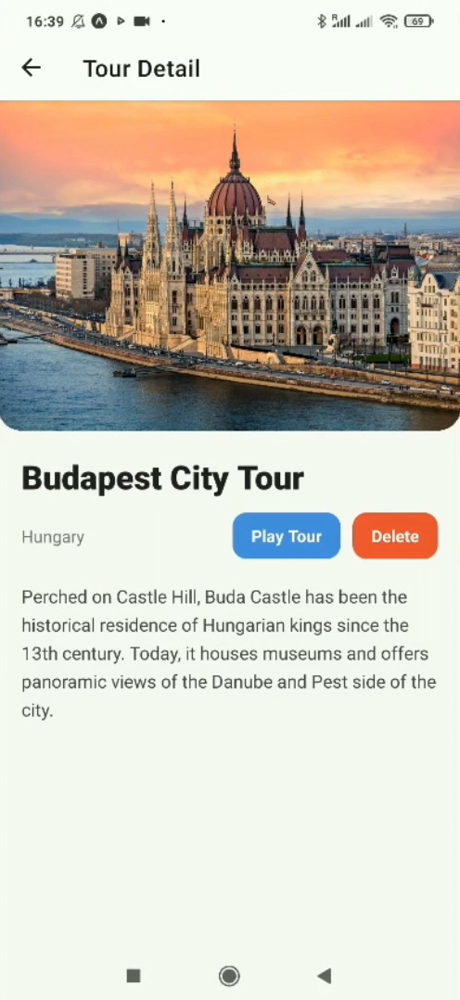
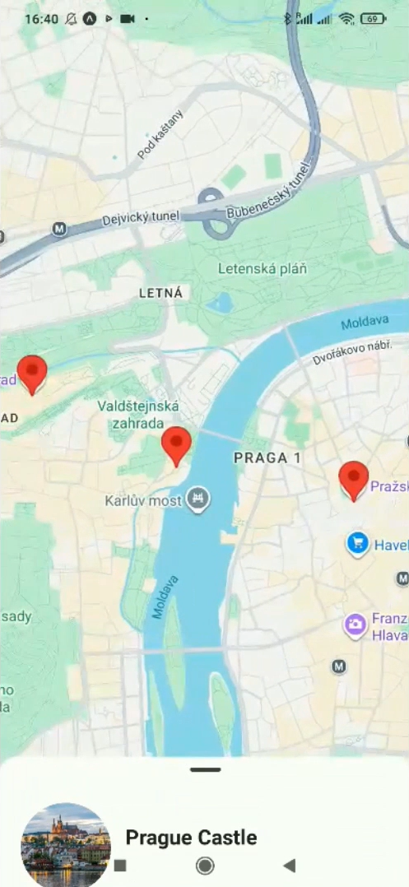

# **MyTour**

MyTour is a mobile application that delivers **self-guided, multimedia-rich tours** for independent travelers. Users can browse tours created by local experts, purchase or access free ones, and explore destinations using interactive maps and GPS-triggered content.

---

## 🛠️ **Tech Stack**

**Backend**

- Java Spring Boot
- PostgreSQL
- JWT Authentication

**Frontend**

- React Native
- REST API integration

---

## 📱 **Screenshots**

### 🔐 Authentication

Signup & Login

<p align="center">
  
  
</p>

---

### 🗺️ Creating a Tour

Create Tour & Pick Location

<p align="center">
  
  
</p>

---

### 🔍 Browsing Tours

Explore All Tours & Explore a Single Tour

<p align="center">
  
  
</p>

---

### ▶️ Following a Tour

Following & Enjoying a Tour

<p align="center">
  
  
</p>

---

## 🚀 **Features**

- Browse available tours
- Purchase or access free tours
- GPS-triggered audio/visual content
- Interactive map with POIs
- Create tours as a local expert
- Secure authentication using JWT

---

## 📦 **Installation**

### Backend

```bash
cd backend
./mvnw spring-boot:run
```

### Frontend

```bash
cd frontend
npm install
npm start
```

---

